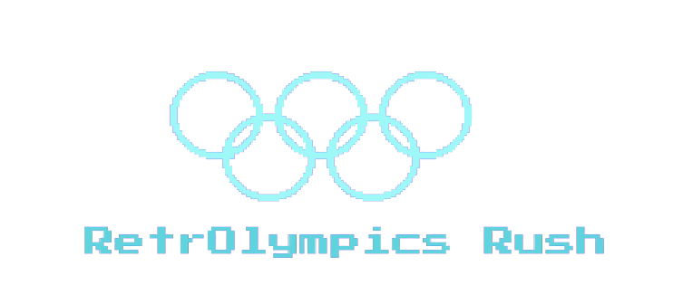
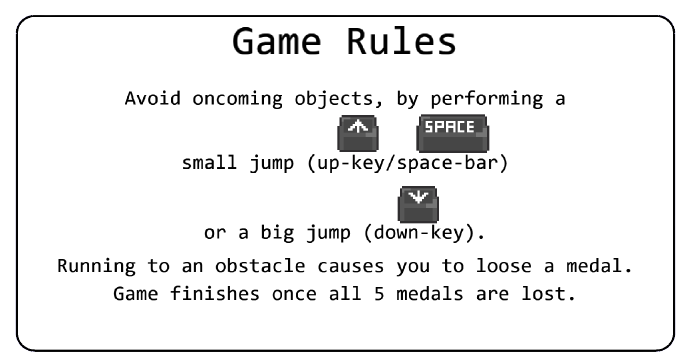
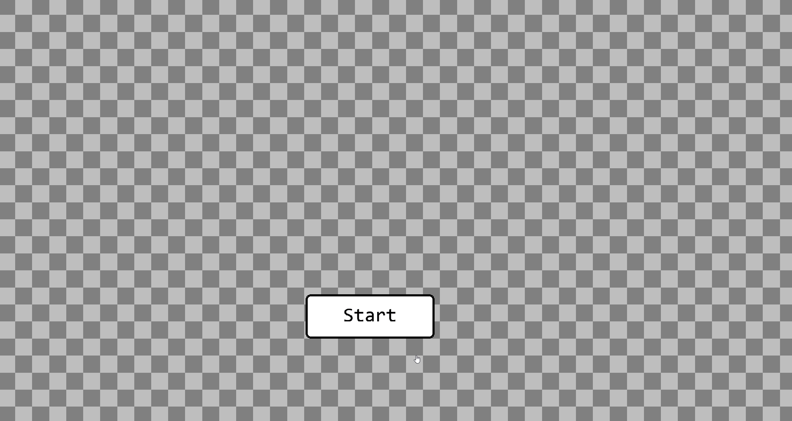
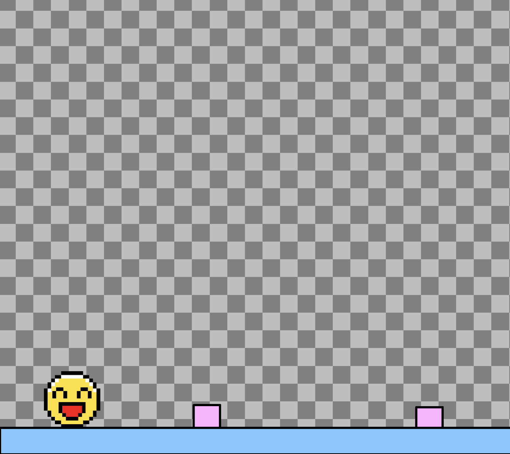
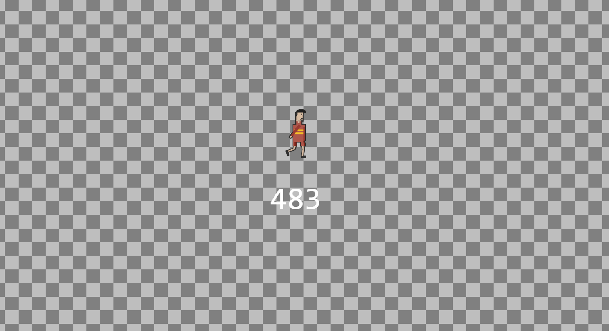

<div align=center>



<h1><strong>RetrOlympics Rush: a Sidescroller Game</strong></h1>

 


## Introduction
The goal of the project was to provide a **fun and challenging game that has an appealing retro aesthetic that nostalgic players will enjoy.** 
The player must navigate an Olympic-themed obstacle course in front of a crowd of fans. During gameplay, the player can choose to ```jump``` or ```double-jump``` over obstacles, and risks losing a gold coin on each collision.

**The target audience is anyone who wants to play a retro-inspired game and is a fan of the Olympics.** The game is fun and challenging, and has an appealing retro aesthetic that nostalgic players will enjoy.

</div>

## Deployment

[](https://lmcrean.github.io/RetrOlympics-Rush/)

This project is deployed and can be accessed at [https://lmcrean.github.io/RetroOlympics-Rush/](https://lmcrean.github.io/RetroOlympics-Rush/).

***

## User Stories

Our team addressed the criteria by organising our project into User Stories, then further breaking down with the MoSCoW Prioritisation method.

- As a player, I need the design on **Desktop.**

- As a player, I need the design to be consistent, with a **neon Retro 1980’s Olympic theme.**

- As a player, I want to be able to **see my score on the screen** and have an idea of how I’m doing in the game.

- As a player, I want to be able to **control my character.**

- As a player, I need to an **accessible tutorial screen** to understand how to play the game.

- As a player, I need to be able to **control the volume.**

- As a player, I want to be able to **see animations** as my character moves in the environment.

- As a player, I want to be able to **interact with obstacles.**

- As a player, I need to an **accessible Game Over page** with appropriate features e.g. Restart, See score.

- As a player, I need to experience an **appropriate level of difficulty and challenge.**

***

## Features

The features are intended to enhance gameplay, while reinforcing the retro aesthetic. Accessibility was also consider.

### Rules



During Gameplay, the player can choose to ```jump``` or ```double-jump```
Features include a scoreboard and game over screen.

The rules helps the player understand how to play the game.

- **jump** = ⬆️ ```up key``` / ```spacebar```
- **double jump** = ⬇️```down key```

### Start Button


(from an earlier implementation of the game)


### Jump Feature


The player can use the spacebar to jump. The player can use the mouse to click on the screen to jump.

### Double Jump Feature


(from an earlier implementation of the game)

The player can use the down arrow key to double jump. This makes the game more challenging and fun.

### Score
The scoreboard is tracked in the top-left corner, it updates as the player advances through the assault course and is displayed as a final score in the "game over screen".

### Background music

There is retro themed background music during gameplay. An 8 bit version was selected of The French National Anthem was used it fits in with the retro theme and is a nod to the 2024 Paris Olympics.

### Sound Effects

There are sound effects for
 
-  collisions
-  jumping
-  clicking on a button
-  game over

### Lives remaining


(from an earlier implementation of the game)

### Game Over


***

## Game Research

- Simple sidescroller games such as Flappy Bird and Chrome Dino were researched as they had well resourced tutorials

## KaBoom.js Resources

Kaboom.js was used as our primary framework the team adapted various templates 

To begin with we used a template from the Kaboom.js website to get started and adapted the code to suit our needs.

- [Kaboom.js](https://kaboomjs.com/) Provided the library of functions for the game
- [Kaboom Playground](https://kaboomjs.com/play?example=add) Kaboom had a library of code playgrounds that were particularly useful for quick testing of the framework functions

### Media credits
[8-bit French National Anthem.](https://www.youtube.com/watch?v=dL4MbnOKCow) by [KSO 8-bit anthems on YouTube](https://www.youtube.com/@kso8-bitanthems875)

Open sources graphics were used from these websites:
- https://www.freepik.com/
- https://all-free-download.com/


## Credits 

Alena: Design, sourcing media, Obstacle Logic
Berat: Lives remaining feature, sourcing National Anthem
Chinonso: Buttons, menu logic, game over screen
Gennadiy: Jumping logic, technical support
Hilla: Javascript lead, SFX logic, game over screen
Tina: Mute/unmute button,
Laurie: Scrum Master

